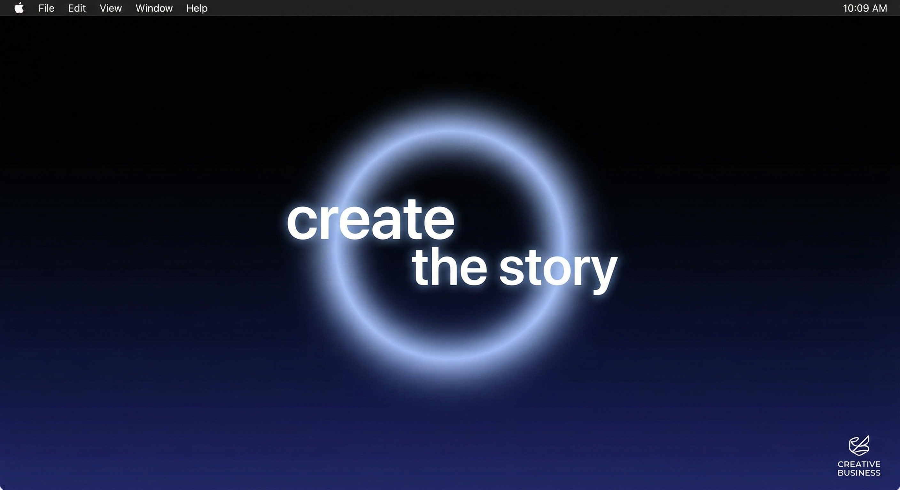
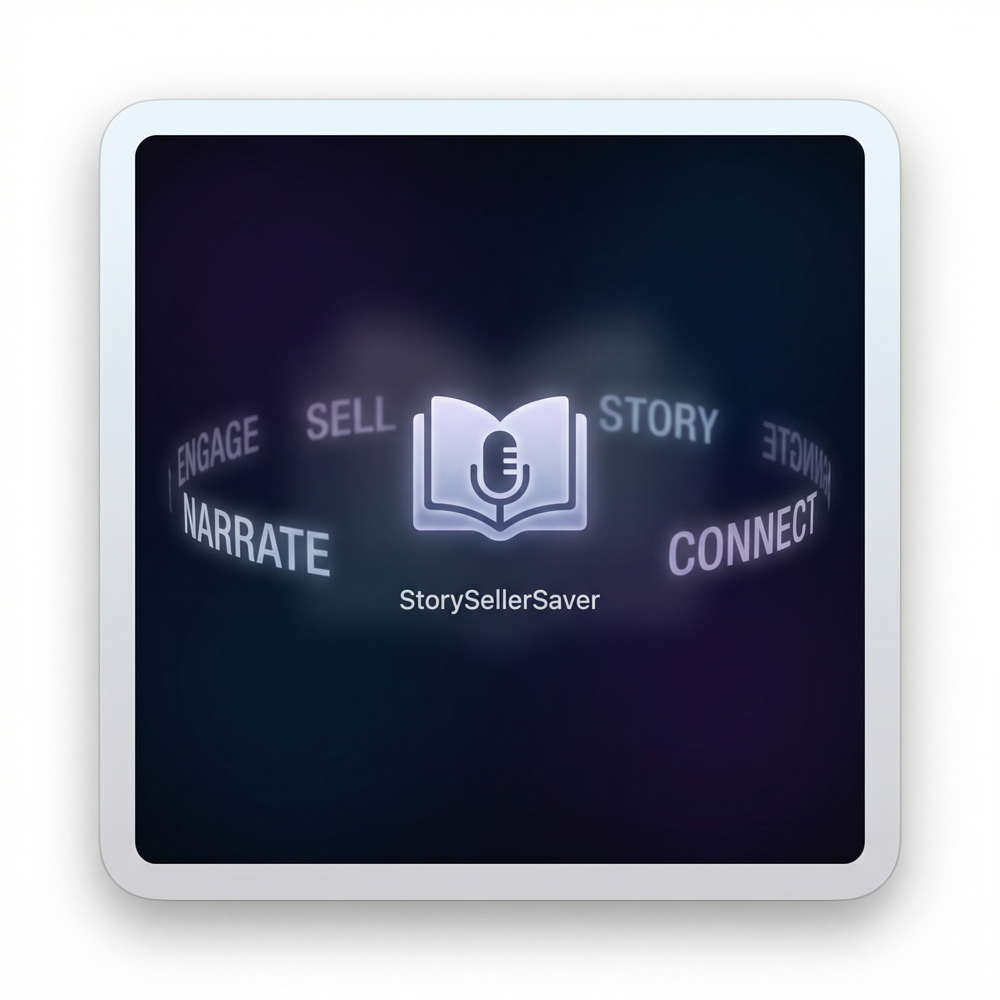

# StorySellerSaver

A sophisticated macOS screensaver that displays an elegant word carousel forming meaningful phrases in a continuous loop. Features smooth animations, accessibility support, and responsive typography that scales beautifully across different screen sizes.



**System Settings Thumbnail:**


## ✨ Features

- **Elegant Word Carousel**: Cycles through action words ("create", "develop", "produce", "manage", "sell") paired with "the story"
- **Smooth Animations**: 60fps animations with easing curves and hold periods for optimal readability
- **Accessibility Support**: Automatically reduces motion for users who prefer reduced motion
- **Responsive Design**: Typography scales dynamically based on screen size
- **Performance Optimized**: Uses background caching and efficient rendering
- **Clean Typography**: Custom font stack (Poppins → Avenir → Helvetica → System) with proper kerning and spacing
- **Subtle Visual Effects**: Gradient backgrounds, soft glows, and depth through shadows
- **Floating Logo**: "CREATIVE BUSINESS" text that gracefully moves around the screen every 5 minutes
- **Breathing Glow Effect**: Subtle pulsing glow that creates depth and visual interest

## 🎯 What It Does

The screensaver creates an immersive visual experience with multiple animated elements:

### Word Carousel
Cycles through action words paired with "the story":
- "create **the story**"
- "develop **the story**"
- "produce **the story**"
- "manage **the story**"
- "sell **the story**"

Words smoothly scroll vertically while "the story" remains centered, creating a hypnotic and professional display.

### Floating Logo
A subtle "CREATIVE BUSINESS" logo that:
- Moves gracefully around the screen every 5 minutes
- Uses smooth easing animations
- Positions itself randomly in safe areas
- Maintains pixel-perfect alignment

### Ambient Effects
- **Breathing glow**: Subtle pulsing effect around the center phrase
- **Gradient background**: Deep blue to black gradient for depth
- **Soft vignette**: Edge darkening for focus
- **Dynamic shadows**: Text shadows that scale with prominence

Perfect for creative professionals, agencies, and anyone who wants an elegant, non-distracting screensaver.

## 🔧 Requirements

- **macOS 10.15+** (Catalina or later)
- **Xcode 14.0+** (for development)
- **Swift 5.7+**

## 🚀 Quick Start

### For End Users: Install the Screensaver

📖 **Detailed installation guide**: See [INSTALL.md](INSTALL.md) for comprehensive instructions.

**Quick install**:
1. **Download** the latest `StorySellerSaver.saver.zip` from [Releases](../../releases/latest)
2. **Unzip** the downloaded file
3. **Install** by double-clicking the `.saver` file
4. **Configure**: Open `System Settings` → `Screen Saver` → select `StorySellerSaver`

**How to find it**: Look for the thumbnail showing a dark background with "create the story" text and a "CREATIVE BUSINESS" logo in the corner.

### For Developers: Build from Source

#### Quick Development Preview

```bash
# Build and preview in one command
./scripts/preview_screensaver.sh --build
```

#### Create Releases

```bash
# Patch release (1.0.0 -> 1.0.1)
make release-patch

# Minor release (1.0.0 -> 1.1.0)
make release-minor

# Major release (1.0.0 -> 2.0.0)
make release-major

# Specific version
make release-version VERSION=1.2.3

# Preview what would be released
make release-dry-run
```

**What happens during release:**
- ✅ Code is built in Release configuration
- ✅ Screensaver is packaged as `.zip` file
- ✅ GitHub Release is created automatically
- ✅ Downloadable asset is attached to release
- ✅ Users can download and install directly

#### Option 2: Manual Installation

1. **Open in Xcode**
   ```bash
   open StorysellerScreensaver.xcodeproj
   ```

2. **Build the Project**
   - `Product → Build` (⌘B)
   - Or use the build script: `./scripts/build_link_preview.sh`

3. **Install**
   - The built `.saver` file will be in: `~/Library/Developer/Xcode/DerivedData/.../Build/Products/Debug/StorySellerSaver.saver`
   - Double-click to install (install for current user)
   - Open `System Settings → Screen Saver` and select **StorySellerSaver**

## 📁 Project Structure

```
StorySellerSaver/
├── README.md                          # This file
├── .gitignore                         # Git ignore rules
├── Info.plist                         # Project metadata
├── StorySellerSaver/                  # Main screensaver code
│   ├── Info.plist                     # Bundle configuration
│   └── StorySellerSaverView.swift     # Core screensaver logic
├── StorySellerSaverInfo.plist         # Additional bundle info
├── StorysellerScreensaver.xcodeproj/  # Xcode project files
│   ├── project.pbxproj               # Project configuration
│   ├── project.xcworkspace/          # Workspace data
│   └── xcshareddata/                 # Shared project settings
└── scripts/                          # Development utilities
    ├── build_link_preview.sh         # Build and link for testing
    ├── check_screensaver_install.sh  # Installation verification
    ├── preview_screensaver.sh        # Development preview tool
    └── preview_then_confirm.sh       # Interactive testing
```

## 🛠️ Development Scripts

### `preview_screensaver.sh`
Advanced development preview script with multiple options:

```bash
# Basic preview (builds and installs debug version)
./scripts/preview_screensaver.sh --build

# Release build preview
./scripts/preview_screensaver.sh --release --build

# Clean install (removes old version first)
./scripts/preview_screensaver.sh --build --clean

# Skip version bumping
./scripts/preview_screensaver.sh --build --no-bump

# Don't restart screensaver engine
./scripts/preview_screensaver.sh --build --no-restart
```

### `build_link_preview.sh`
Creates a symbolic link for faster iteration during development:

```bash
# Debug build (default)
./scripts/build_link_preview.sh

# Release build
./scripts/build_link_preview.sh --release
```

### `check_screensaver_install.sh`
Verifies screensaver installation and provides troubleshooting info.

## 🎨 Technical Details

### Animation System
- **60 FPS**: Smooth 60fps animations using `ScreenSaverView.animateOneFrame()`
- **Timing**: Configurable movement (1.2s) and hold (0.6s) periods per word
- **Easing**: Smooth transitions with configurable easing curves
- **Accessibility**: Respects `accessibilityDisplayShouldReduceMotion`

### Typography
- **Font Stack**: Poppins → Avenir Next → Helvetica Neue → System Font
- **Scaling**: Responsive sizing based on screen dimensions
- **Kerning**: Proper letter spacing (-0.2 for center text, -0.15 for words)
- **Alignment**: Baseline-aligned text positioning for visual harmony

### Visual Effects
- **Background**: Subtle gradient from dark blue-gray to near black
- **Vignette**: Soft edge darkening for focus
- **Glow**: Radial gradient glow behind the center phrase
- **Shadows**: Dynamic drop shadows that scale with word prominence
- **Fade**: Smooth alpha transitions for entering/leaving words

### Performance Optimizations
- **Background Caching**: Pre-rendered background image
- **Efficient Rendering**: Only redraws changed regions
- **Memory Management**: Proper cleanup and resource management
- **Layer Backing**: Uses Core Animation layers for smooth compositing

## 🤝 Contributing

We use **Gitflow** for our development workflow. See [GITFLOW.md](GITFLOW.md) for detailed instructions.

### Quick Start for Contributors
```bash
# 1. Clone and setup
git clone https://github.com/yourusername/storyseller-screensaver.git
cd storyseller-screensaver
./scripts/setup-dev.sh

# 2. Start a feature
./scripts/gitflow.sh feature start your-feature-name

# 3. Develop and commit
make build    # Test your changes
git add .
git commit -m "Add your feature"

# 4. Finish feature
./scripts/gitflow.sh feature finish your-feature-name
```

### Development Guidelines
- Test on multiple screen sizes (preview and full screen)
- Verify accessibility with reduced motion enabled
- Ensure smooth 60fps performance
- Follow Swift coding conventions
- Add comments for complex animation logic
- Use Gitflow workflow for all changes

## 🎨 Customization & Future Features

### Current Features
- ✅ **Word carousel**: Customizable action words
- ✅ **Floating logo**: "CREATIVE BUSINESS" positioning
- ✅ **Color themes**: Dark gradient background
- ✅ **Animation speeds**: Optimized timing
- ✅ **Font selection**: Automatic fallback system

### Planned Features
- 🔄 **Customizable text**: User-defined words and phrases
- 🔄 **Color schemes**: Light/dark themes, custom colors
- 🔄 **Animation controls**: Speed and easing adjustments
- 🔄 **Logo customization**: Custom text and positioning
- 🔄 **Multiple layouts**: Different visual arrangements

### Contributing Ideas
Have suggestions for customization? We'd love to hear them! Open an [issue](../../issues) or start a [discussion](../../discussions).

## 📦 Releases & Downloads

- **Latest Release**: [Download here](../../releases/latest)
- **Development Builds**: Available via GitHub Actions artifacts
- **System Requirements**: macOS 10.15+

## 🐛 Reporting Issues

Found a bug or have a feature request?
1. Check [existing issues](../../issues)
2. Create a new issue with:
   - macOS version
   - Screen resolution
   - Steps to reproduce
   - Expected vs actual behavior

## 📄 License

This project is open source. Please see the LICENSE file for details.

## 🙏 Acknowledgments

- Built with Apple's ScreenSaver framework
- Typography inspired by modern design systems
- Animation timing based on user experience best practices
- Community feedback and contributions

---

## 📸 Capturing Screenshots

Want to create authentic screenshots of your screensaver? See [SCREENSHOT-HOWTO.md](docs/SCREENSHOT-HOWTO.md) for detailed instructions on capturing the screensaver in action.

---

**Made with ❤️ for macOS users who appreciate elegant, purposeful screensavers**

*Ready to enhance your screen saver experience? [Get started with INSTALL.md](INSTALL.md)!*
